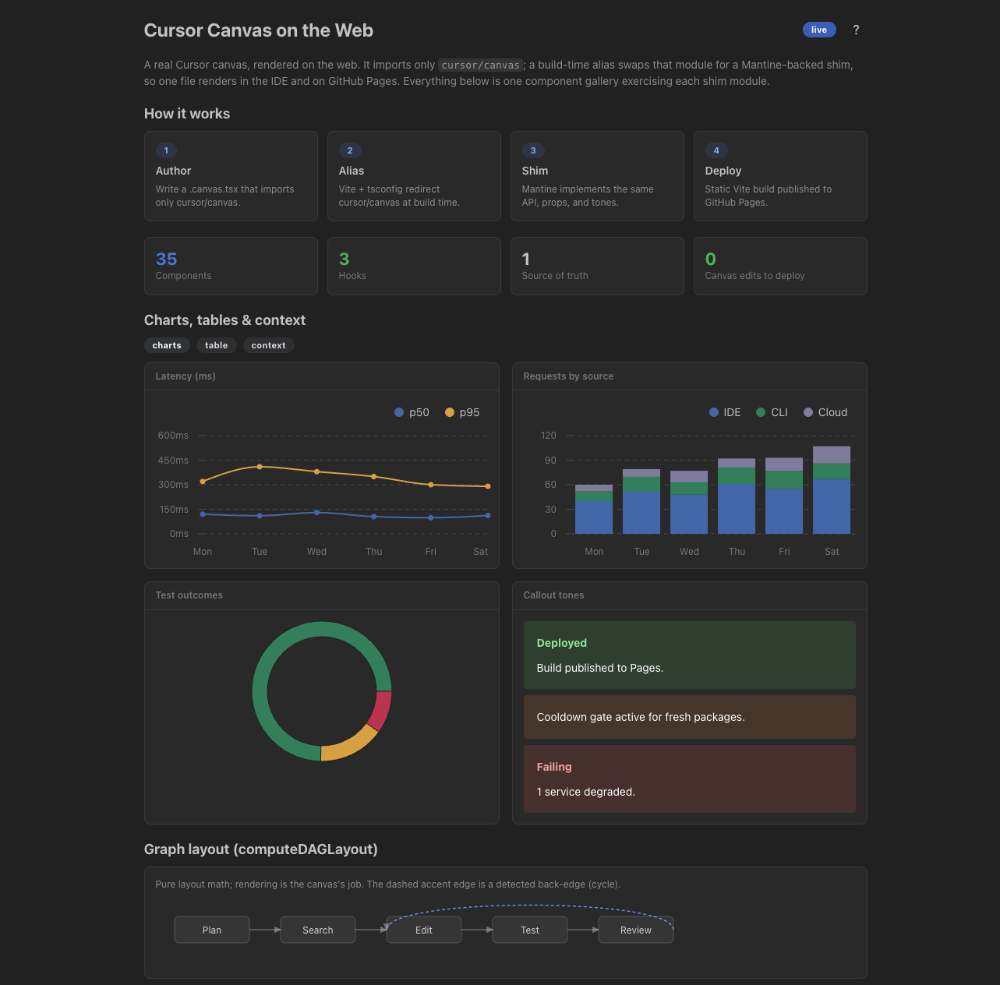

# cursor-canvas-web

Deploy **Cursor canvases** to the web.

A Cursor canvas is a `.tsx` that imports only from `cursor/canvas`. That module isn't an installable package; it's provided by the Cursor IDE at compile time, so a canvas can't build or render anywhere outside the IDE. This project is an open, **Mantine-backed shim** of `cursor/canvas`. A build-time Vite alias swaps the module for the shim, so the same `.tsx` renders in the Cursor IDE and on the web. No converter, no fork of your source.

**Live example:** <https://thisismydesign.github.io/cursor-canvas-web/>



## How it works: a module shim, not a converter

Your canvas stays a normal `.tsx` React component that imports only from
`cursor/canvas`. The only bridge is one module that re-exports that API
implemented with Mantine. A Vite alias (plus a matching tsconfig path) resolves
`cursor/canvas` to the shim at build time. There is no parser, AST, or registry,
and your canvas source never changes.

```
your.canvas.tsx          Vite alias +          @thisismydesign/cursor-canvas-web
imports "cursor/canvas" -> tsconfig paths    -> Mantine core + @mantine/charts
                                             -> Vite build -> any static host
```

Because the shim mirrors the real SDK API, a canvas that builds here also
compiles and renders unchanged in the Cursor IDE.

## Install

```bash
pnpm add @thisismydesign/cursor-canvas-web
# peer deps your app must supply:
pnpm add react react-dom @mantine/core @mantine/charts recharts
```

The package ships two entry points:

| Import                                      | Provides                                      |
| ------------------------------------------- | --------------------------------------------- |
| `@thisismydesign/cursor-canvas-web`         | The `cursor/canvas` shim (components, hooks). |
| `@thisismydesign/cursor-canvas-web/runtime` | `CanvasRoot` + `mountCanvas` web host glue.   |

## Use it in your project

### 1. Point `cursor/canvas` at the package

Two coordinated settings — runtime (Vite) and types (tsconfig) — keep your
canvas sources pure while resolving the bare specifier to the shim:

```ts
// vite.config.ts — runtime
resolve: {
  alias: {
    'cursor/canvas': '@thisismydesign/cursor-canvas-web',
  },
}
```

```jsonc
// tsconfig.json — types
"paths": {
  "cursor/canvas": ["./node_modules/@thisismydesign/cursor-canvas-web"]
}
```

### 2. Mount your canvas

Use the `mountCanvas` helper (it wraps `MantineProvider` for you):

```tsx
// src/main.tsx
import { mountCanvas } from '@thisismydesign/cursor-canvas-web/runtime';
import '@mantine/core/styles.css';
import '@mantine/charts/styles.css';
import MyCanvas from '../.cursor/canvases/my.canvas';

mountCanvas('root', <MyCanvas />);
```

Or, if you manage your own React root, wrap the tree with `CanvasRoot`:

```tsx
import { CanvasRoot } from '@thisismydesign/cursor-canvas-web/runtime';
import '@mantine/core/styles.css';
import '@mantine/charts/styles.css';

createRoot(el).render(
  <CanvasRoot defaultColorScheme="auto">
    <MyCanvas />
  </CanvasRoot>,
);
```

The canvas file itself never changes — it still imports only from
`cursor/canvas`, so it renders identically in the Cursor IDE.

### 3. Deploy

The result is a plain Vite app, so `pnpm build` produces a static `dist/` you
can host anywhere (GitHub Pages, Netlify, Vercel, S3, …). This repo deploys its
example canvas to GitHub Pages — see [Example deployment](#example-deployment).

## Supported canvas API

The shim implements the **full public `cursor/canvas` surface**:

- Typography: `H1`, `H2`, `H3`, `Text`, `Code`, `Link`
- Layout: `Stack`, `Row`, `Spacer`, `Grid`, `Divider`, `mergeStyle`
- Surfaces: `Card`/`CardHeader`/`CardBody` (incl. `collapsible`)
- Display & feedback: `Stat`, `Pill`, `Callout`, `Table`
- Actions: `Button`, `IconButton`
- Forms: `Select`, `Checkbox`, `Toggle`, `TextInput`, `TextArea`
- Charts: `LineChart`, `BarChart`, `PieChart`
- Rich: `Swatch`, `UsageBar`, `CollapsibleSection`, `TodoList`/`TodoListCard`,
  `DiffView`/`DiffStats`, `computeDAGLayout`
- Hooks: `useCanvasState`, `useHostTheme`, `useCanvasAction`
- Tokens: `colorPalette`, `usageColorSequence`, `canvasTokens(Light)`,
  `canvasPalette(Dark|Light)`

Known fidelity gaps (behavior is reproduced, not the exact renderer):
`DiffView` skips Shiki syntax highlighting (plain-text fallback), and
`useCanvasAction` is a no-op on the web (IDE-only). Styling approximates the
Cursor theme rather than matching it pixel-for-pixel.

If your canvas needs an export the shim doesn't yet provide, see
[Extending the shim](#extending-the-shim).

## Example deployment

This repo is itself a working example. The canvas at
[`.cursor/canvases/demo.canvas.tsx`](./.cursor/canvases/demo.canvas.tsx) is the
single source of truth: the web app imports it directly, and the same file is
copied into Cursor's managed canvases folder so it renders in the IDE too.

The deployed result lives at
<https://thisismydesign.github.io/cursor-canvas-web/>.

`deploy.yml` builds and publishes to GitHub Pages on push to `main` via
`configure-pages` / `upload-pages-artifact` / `deploy-pages`. The Vite `base`
defaults to `/cursor-canvas-web/` (project Page); override it with the
`BASE_PATH` env var if you deploy elsewhere.

## Develop this repo

Tool versions (Node, pnpm) are pinned in [`.tool-versions`](./.tool-versions)
and managed with [mise](https://mise.jdx.dev/).

```bash
mise install        # install Node + pnpm from .tool-versions
pnpm install
pnpm dev            # start the dev server
```

Validation gate:

```bash
pnpm typecheck      # tsc --noEmit, strict
pnpm lint           # eslint
pnpm test           # vitest run
pnpm build          # typecheck + vite build -> dist/
```

### Layout

| Path                               | Role                                                  |
| ---------------------------------- | ----------------------------------------------------- |
| `.cursor/canvases/demo.canvas.tsx` | The example canvas; imports **only** `cursor/canvas`. |
| `src/shim/cursor-canvas.tsx`       | Mantine implementation matching the real SDK API.     |
| `src/shim/theme.ts`                | Tone→color map + host-theme tokens.                   |
| `src/runtime/index.tsx`            | Web host glue (`CanvasRoot`, `mountCanvas`).          |
| `src/main.tsx`                     | Mounts React inside `MantineProvider`.                |
| `vite.config.ts`                   | `resolve.alias` for `cursor/canvas` + Pages base.     |
| `vite.lib.config.ts`               | Library build (shim + runtime) for publishing.        |
| `tsconfig.json`                    | `paths` maps `cursor/canvas` to the shim.             |

### Extending the shim

To support more of the canvas API:

1. Add the export to `src/shim/cursor-canvas.tsx`, implemented with Mantine.
2. Keep prop shapes stable — they are the contract canvases rely on, and they
   must match the official SDK declarations so canvases render unchanged in the
   IDE.
3. If it carries semantic color, map `tone` via `toneColor` in
   `src/shim/theme.ts`, using the SDK's tone vocabulary for that primitive
   (`StatTone`, `PillTone`, `CalloutTone`, `ChartTone`).
4. Add a test under `src/shim/__tests__/`.

The only non-trivial adapter so far is `LineChart`, which reshapes parallel
`categories` + `series[]` arrays into Mantine's array-of-row-objects `data` and
maps each series `tone` to a color (`reshapeLineChartData`).

### Publishing

`prepublishOnly` runs `typecheck`, `test`, and `build:lib` automatically, so a
publish only needs:

```bash
npm login
npm publish --access public
```

`--access public` is required for the scoped package. Publishing needs 2FA
(WebAuthn/passkey) on your npm account; `npm publish` opens a browser to
complete the passkey prompt.
